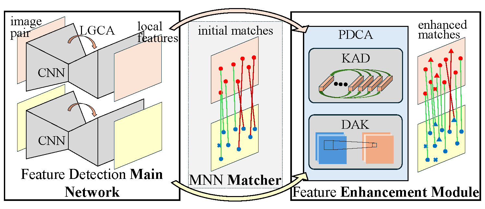
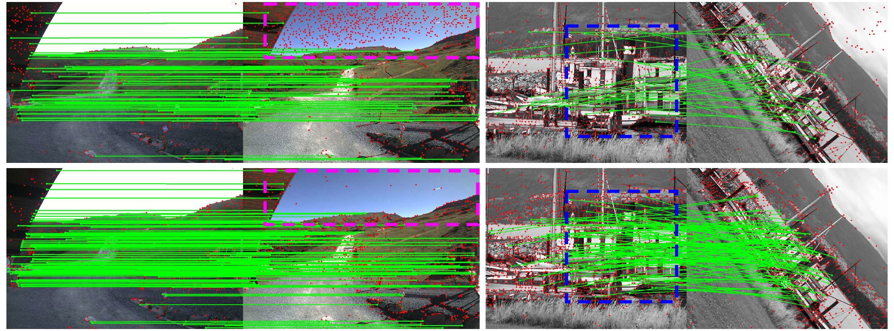

# CA$^{2}$Point: Learning Keypoint Detection and Description with Context Aggregation and Cross Augmentation

## Introduction

    

In this work, we propose a novel keypoint detection and description method named CA$^{2}$Point, with a Local & Global 
Context Aggregation (LGCA) module to obtain local and global contexts and a Point & Descriptor Cross Augmentation (PDCA) 
module to simultaneously enhance keypoints and descriptors. With the help of the context aggregation and the cross 
augmentation, our proposed method can extract more keypoints and more discriminative descriptors for matching under 
some challenging scenarios.
- Full paper PDF: [CA$^{2}$Point: Learning Keypoint Detection and Description with Context Aggregation and Cross Augmentation]()
- Authors: Xuebin Meng, Wei Li, Yu Hu, Yinhe Han

## Dependencies

- PyTorch>=2.0.0
- numpy
- opencv-python
- matplotlib
- kornia>=0.6.11
- python>=3.10

We have tested our code in PyTorch2.1.2 and Python3.10, but we believe it can easily run in lower or higher versions as 
we do not use version specific functions.

## Image matching results

In this repo, we provide a [demo notebook](demo.ipynb) which shows how to extract keypoints and descriptors from images 
and how to match keypoints from a pair of images. The pre-trained weight of CA$^{2}$Point is in the weights directory. 
You should see the following result:

    

## Acknowledgements

Part of the code is from previous excellent works including [SuperPoint](https://github.com/magicleap/SuperPointPretrainedNetwork), 
[AWDesc](https://github.com/vignywang/AWDesc), [LoFTR](https://github.com/zju3dv/LoFTR) and [LightGlue](https://github.com/cvg/LightGlue).

